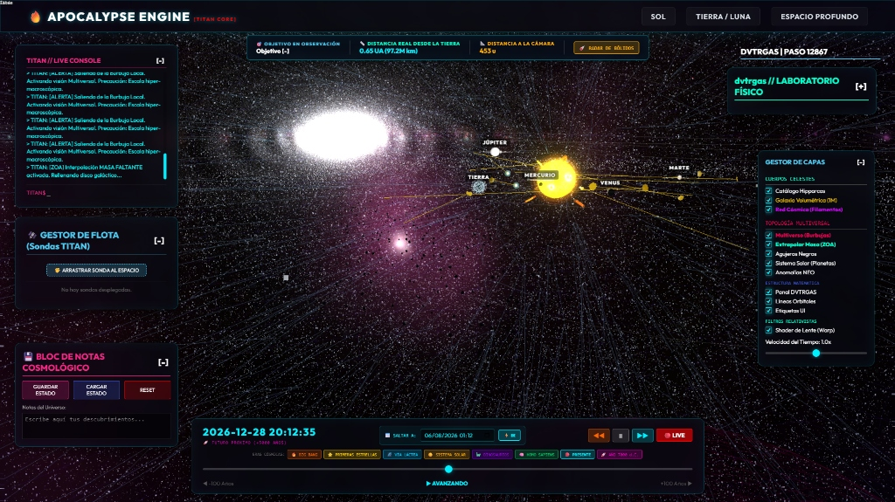
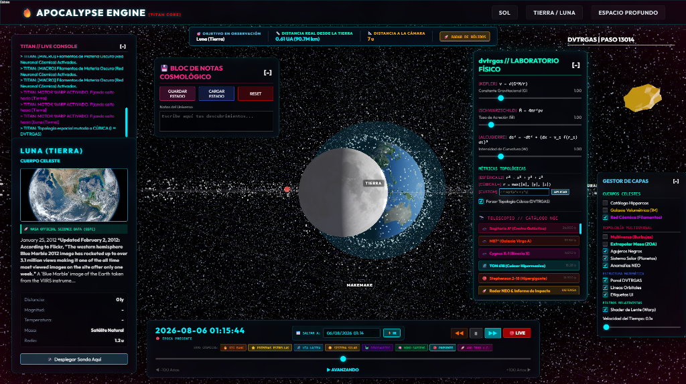
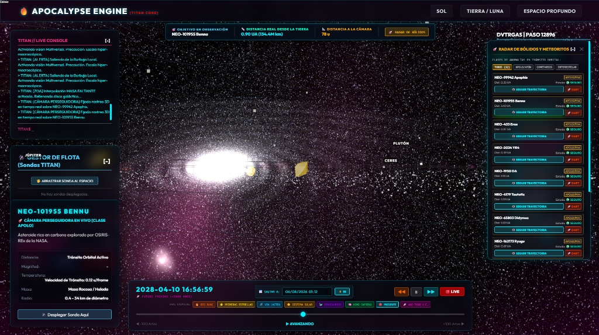
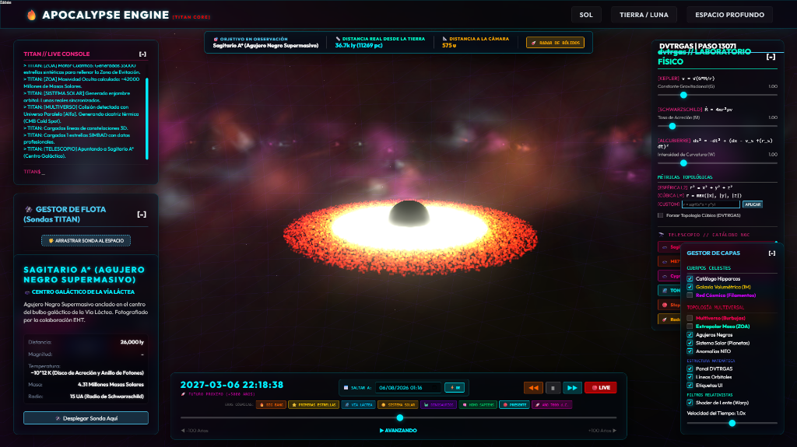
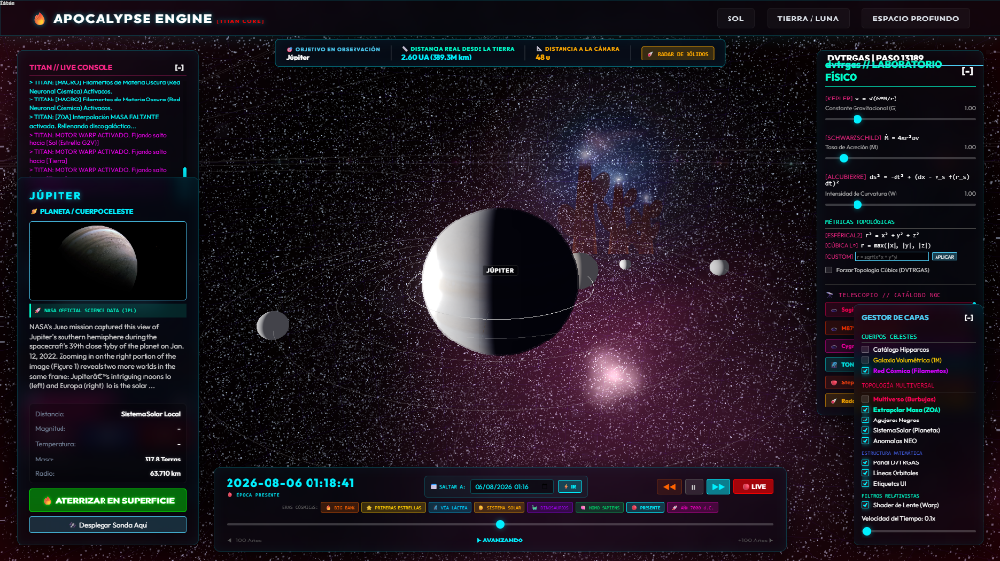

# 🌌 APOCALYPSE ENGINE
### Simulador Cosmológico y Motor de Defensa Planetaria 3D / 3D Cosmological Simulator & Planetary Defense Engine

> **Autor y Creador Original:** José Manuel  
> **Alias:** cyberenigma-lgtm  
> **Copyright © 2026 José Manuel. Todos los derechos reservados.**  
> **Licencia / License:** Propiedad Intelectual Privada (Uso Prohibido Sin Autorización) / Private Intellectual Property (Usage Prohibited Without Authorization)

---

## 📸 Galería del Laboratorio / Laboratory Showcase

<p align="center">
  
  <br><em>Vista General de la simulación con órbitas Keplerianas y la consola Titan en vivo / General view of the simulation with Keplerian orbits and the live Titan console.</em>
</p>

<hr>

<p align="center">
  
  <br><em>Tierra y Luna con telemetría dinámica de distancia a la cámara y vectorización métrica / Earth and Moon with dynamic camera distance telemetry and metric vectorization.</em>
</p>

<hr>

<p align="center">
  
  <br><em>Radar en tiempo real y panel de defensa cinemática contra anomalías NEO (Misión DART) / Real-time radar and kinetic defense panel against NEO anomalies (DART Mission).</em>
</p>

<hr>

<p align="center">
  
  <br><em>Simulación relativista del agujero negro supermasivo Sagitario A* / Relativistic simulation of the supermassive black hole Sagittarius A*.</em>
</p>

<hr>

<p align="center">
  
  <br><em>Visualización orbital del gigante gaseoso Júpiter y sus satélites galileanos / Orbital visualization of the gas giant Jupiter and its Galilean moons.</em>
</p>

---

## 🔭 [ES] ¿Qué es el Apocalypse Engine?

**Apocalypse Engine** es un simulador cosmológico interactivo en tiempo real construido sobre **WebGL + Three.js**, que integra datos astronómicos reales, motores de físicas orbitales y un sistema de defensa planetaria basado en la misión NASA/DART.

Permite explorar el Sistema Solar, la Vía Láctea, agujeros negros supermasivos y miles de millones de años de historia cósmica, todo desde un navegador web.

---

## 🔭 [EN] What is the Apocalypse Engine?

**Apocalypse Engine** is an interactive real-time cosmological simulator built on **WebGL + Three.js**, integrating real astronomical data, orbital physics engines, and a planetary defense system based on the NASA/DART mission.

It allows you to explore the Solar System, the Milky Way, supermassive black holes, and billions of years of cosmic history, all straight from a web browser.

---

## 🧩 [ES] Arquitectura del Sistema
## 🧩 [EN] System Architecture

```
/ApocalypseEngine
  /public
    index.html        ← Interfaz principal del laboratorio / Main laboratory interface
    space_engine.js   ← Motor de renderizado 3D y físicas / 3D Rendering & physics engine (226KB)
    style.css         ← Sistema visual / Cyberpunk UI styling
    /textures         ← Mapas de textura planetaria (NASA) / Planetary textures
    /data             ← Catálogos astronómicos / Astronomical catalogs
  /core               ← Núcleo backend DVTRGAS [PROPIETARIO - No publicado / PRIVATE - Not Published]
  server.py           ← Servidor API de datos astronómicos / Astro data server
  fetch_nebulae.py    ← Generador catálogo nebulosas 3D / 3D Nebula generator
  generate_cosmic_web.py ← Generador red cósmica / Cosmic web generator
  reconstruct_galaxy.py  ← Reconstructor galáctico / Galactic reconstructor
  nebula_photo_to_3d.py  ← Extractor 3D de fotos / Photo to 3D point cloud
  LICENSE             ← Licencia de uso restringido / Restricted License
  CHANGELOG.md        ← Historial de versiones / Version history
```

---

## ⚙️ [ES] Características Principales
## ⚙️ [EN] Main Features

| Módulo / Module | Descripción (ES) | Description (EN) |
|:---|:---|:---|
| 🪐 **Solar System** | Planetas texturizados con sus lunas reales en órbita kepleriana | Textured planets with their real moons in Keplerian orbits |
| ☄️ **NEO Radar** | Modelos 3D científicos de Apofis, 'Oumuamua, Ryugu, Eros, Halley, etc. | Scientific 3D models of Apophis, 'Oumuamua, Ryugu, Eros, Halley, etc. |
| 🛡️ **DART Mission** | Interceptor cinético 3D, pluma de escombros Dimorphos y desvío orbital | 3D kinetic interceptor, Dimorphos debris plume, and orbital deflection |
| 🕳️ **Black Holes** | Sagitario A*, M87*, TON 618 con disco de acreción y anillo de fotones | Sagittarius A*, M87*, TON 618 with accretion disk and photon ring |
| 🌌 **Stellarium** | Catálogo Hipparcos real + Galaxia Volumétrica 1M estrellas + ZOA | Real Hipparcos catalog + 1M Star Volumetric Galaxy + ZOA |
| ⏱️ **Chronograph** | Viaje temporal bidireccional desde el Big Bang hasta el año 7000 d.C. | Bidirectional time travel from the Big Bang to the year 7000 AD |
| 🔬 **DVTRGAS Lab** | Motor de topología espacial con métricas $L_2$ y $L_\infty$ en tiempo real | Spatial topology engine with real-time $L_2$ and $L_\infty$ metrics |
| 🚀 **Hyper-Warp** | Viaje entre objetivos a velocidad lumínica con interpolación Hermite | Point-to-point light-speed travel with Hermite interpolation |
| 🛰️ **Chase Cam 3D** | Cámara perseguidora que sigue bólidos en tránsito orbital | Chase camera tracking bolides in active orbital transit |

---

## 🛡️ [ES] Derechos de Autor y Propiedad Intelectual

> **⚠️ ADVERTENCIA LEGAL:**  
> Este proyecto es **propiedad intelectual exclusiva** de **José Manuel**.

**Queda PROHIBIDO:**
- Copiar o reproducir el código, total o parcialmente.
- Redistribuir en cualquier forma o medio.
- Modificar o crear obras derivadas.
- Usar con fines comerciales.
- Integrar en otros motores o frameworks.
- Reclamar autoría o propiedad sobre el código.

Todos los archivos contienen **marcas de agua digitales** de autoría. Las infracciones serán perseguidas bajo la legislación española de propiedad intelectual y el **Convenio de Berna**. Consulta el archivo [LICENSE](./LICENSE) para los términos completos.

---

## 🛡️ [EN] Copyright and Intellectual Property

> **⚠️ LEGAL WARNING:**  
> This project is the **exclusive intellectual property** of **José Manuel**.

**It is strictly PROHIBITED to:**
- Copy or reproduce the code, in whole or in part.
- Redistribute in any form or medium.
- Modify, transform, or create derivative works.
- Use for commercial or lucrative purposes.
- Integrate into other engines or frameworks.
- Claim authorship or ownership of the code.

All files contain **digital watermarks** for authorship tracking. Violations will be prosecuted under Spanish Intellectual Property Law and the **Bern Convention**. See the [LICENSE](./LICENSE) file for the full terms.

---

## 🧬 [ES] Módulos Propietarios (No Publicados)
## 🧬 [EN] Proprietary Modules (Not Published)

Los siguientes componentes son de nivel crítico y **no están incluidos** en este repositorio público: / The following critical components are private and **not included** in this public repository:

- Motor DVTRGAS completo (métricas topológicas avanzadas) / Complete DVTRGAS engine
- Predictor NEO de impacto planetario / NEO planetary impact predictor
- Módulo de topología multiversal / Multiversal topology module
- Consola interna TITAN / Internal TITAN console
- Base de datos de conocimiento astronómico privado / Private astronomical knowledge base

---

## 🚀 [ES] Ejecución Local
## 🚀 [EN] Local Execution

```bash
# 1. Clonar el repositorio / Clone the repository
git clone https://github.com/cyberenigma-lgtm/TITAN-Interactive-Cosmos-Lab.git

# 2. Iniciar el servidor de datos / Start the data server
python server.py

# 3. Abrir en el navegador / Open in your browser
http://localhost:8080
```

---

*Creado con precisión científica y visión cosmológica por / Created with scientific precision and cosmological vision by **José Manuel** — 2026*
